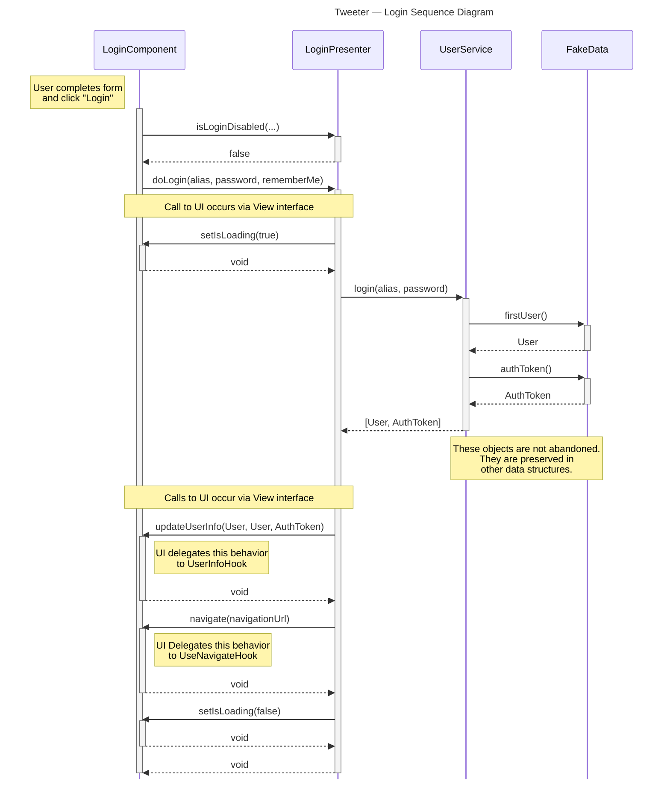

# Login Sequence Diagram

## Prompt
A UML sequence diagram demonstrating what happens when a user successfully logs in.
* This diagram should start with the user initiating a login by pressing a button on the Login component.
* This diagram should at least span from the component to the Service and back (to the Listener/View).
* We have compiled a style guide of common errors to help you here.
* We have an example of a correct, unrelated, sequence diagram on the FAQ page.

## Diagram

