# Story Service UML Diagram

## Prompt
A UML class diagram demonstrating your program's story service (however you get a set of statuses to display for a user's story).
The diagram should include major attributes, operations, and relationships between the classes throughout the process of executing the service.
The diagram should consist of the view, presenter, service, and domain classes that are relevant to the service.
If you have other classes that are important in implementing the service, include them in the diagram.
Include enough details to give the reader an understanding of your design's overall structure, but do not include every detail.
Including too much detail clutters the diagram and harms its readability.
If we want more details, we can always look at your source code.

## Diagram

```mermaid
---
title: Tweeter — Story Service Class Diagram
---
classDiagram

%% Presenters and their relationships

namespace BasePresenters {
    class Presenter~V~ {
        + get view V
        # doTryOperation()
    }
    class ServicePresenter~V, U~ {
        + get service U
    }

    class PagedItemPresenter~T, U~ {
        + loadMoreItems(authToken, userAlias)
        + reset()
        # itemDescription*
        # doLoadMoreItems()*
        - lastItem T
        - pageSize int
    }

}

<<Abstract>> Presenter
<<Abstract>> ServicePresenter
<<Abstract>> PagedItemPresenter

%% I would organize this to the tail of the file, but that messes with the rendering of the diagram
ItemScrollerHook --> PagedItemPresenter  

Presenter <|-- ServicePresenter
ServicePresenter <|-- PagedItemPresenter

%% Scrollers and their relationships

namespace ItemScrollers {
    class ItemScroller~T~ {
        - presenterGenerator(view)
        - addItems(items)
        - PAGE
    }
    class ItemScrollerHook~T~ {
        - presenterGenerator(view)
        + items: T[]
        + loadMoreItems()
        + hasMoreItems: bool
    }
    class StatusItemScroller


}

<<Abstract>> ItemScroller

ItemScroller <|-- StatusItemScroller
StatusItemScroller *-- "*" StatusItem
ItemScroller *-- "1" ItemScrollerHook
StatusItem *-- "1" Post
StatusItem : + status Status
Post : + status Status

%% (Some) Services and their relationships

namespace Services {
    class StatusService {
        + loadMoreFeedItems()
        + loadMoreStoryItems()
        + postStatus()
    }
}


%% Connecting Relationships

class StoryPresenter
class StatusItemPresenter
<<Abstract>> StatusItemPresenter

PagedItemPresenter <|-- StatusItemPresenter
StatusItemPresenter <|.. StoryPresenter
StatusItemPresenter <|.. FeedPresenter

StatusService <.. StatusItemPresenter


```

