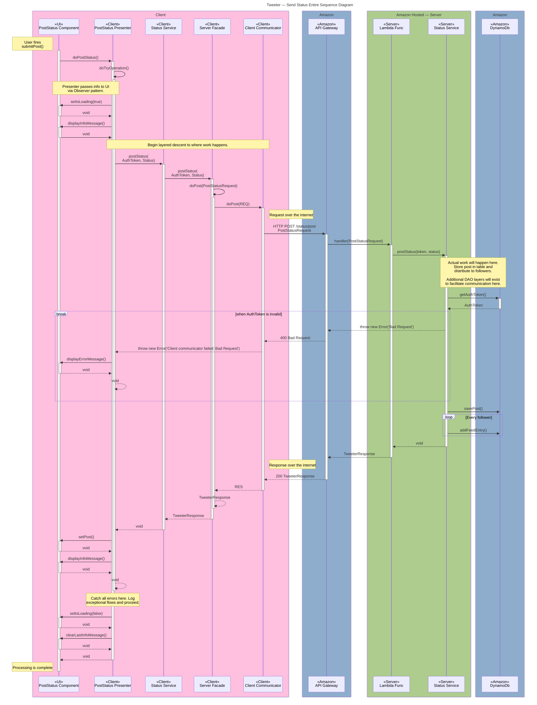

# Submit Status Sequence Diagram

An expanded, and layer-detailed sequence diagram portraying the transformations
that a status undertakes as it is transferred from the client to the server.

Individual layers are depicted without merging together to emphasize the **modularity**
and flexibility which this system supports. Changes can be introduced at any of the
provided layers to control and adjust the behavior of the entire product.

## Sequence Diagram

